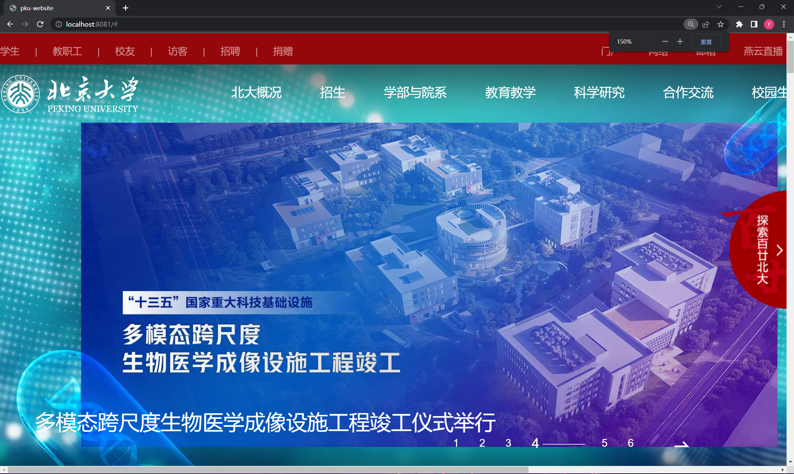

# Web开发第五次作业-高校网站模仿
- 此项目选取北京大学官网首页进行模仿
- 项目在完成度上完成了网站的大部分功能(响应式布局部分未完成，部分轮播图未完成，主页轮播图使用`slick.js`触摸轮播图插件)
- 项目使用`webpack 5`进行项目开发，打包，代码部分则是基本的`HTML`和`CSS`代码，并有少量js代码(`jQuery`库)作为网站部分动效的实现
## 调试代码
- 初次调试本项目，可以直接使用dist目录下打包好的文件预览
- 也可以简单配置`node`环境后使用
## 配置环境

1. 初始化 npm 
```
npm init -y
```
2. 执行下面命令安装依赖
```
npm install
```
3. 运行项目
```
npm run dev
```
4. 打包项目
```
npm run build
```
## 项目展示
**3414×1896(50%)**


**1707×948(100%)**


**1138×632(150%)**


